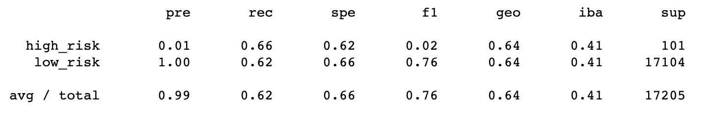
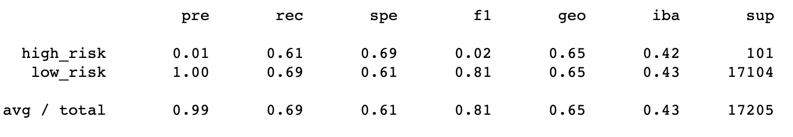
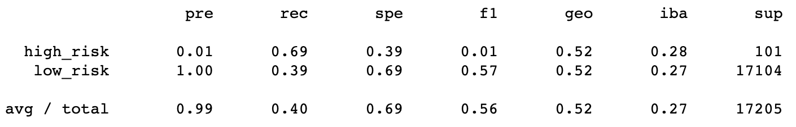
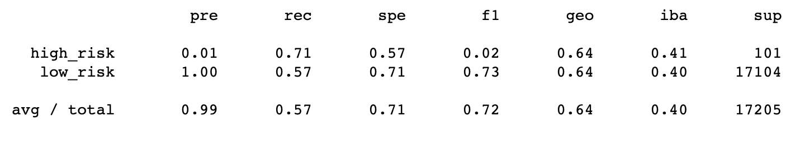
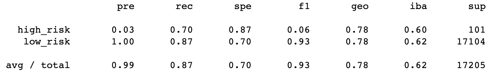
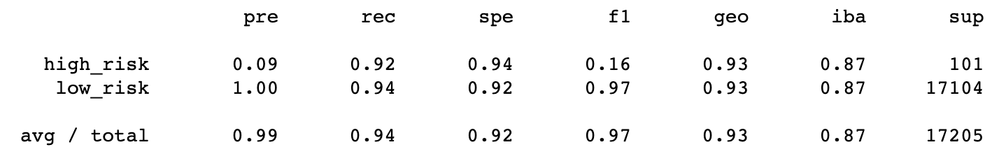

# Credit Risk Analysis

## Overview of the Analysis

### Purpose

The purpose of the analysis is to implement six sampling and ensemble machine learning methods for the classification of binary outcomes in a credit risk dataset.

## Results

### Accuracy Scores

Accuracy Scores are produced for all six methods with the "balanced_accuracy_score" method available in the scikit-learn library, as in the following example (where "y_test" is the binary outcome actual test data and "y_pred" is the binary outcome predicted test data):

```
balanced_accuracy_score(y_test, y_pred)
```

The Accuracy Scores for the methods:

* **Naive Random Oversampler**: 0.6403
* **SMOTE Oversampler**: 0.6515
* **Cluster Centroids Undersampler**: 0.5439
* **SMOTEEN Combination Sampler**: 0.6429
* **Balanced Random Forest Classifier**: 0.7885
* **Easy Ensemble Classifier**: 0.9317

### Precision and Recall Scores

Precision and Recall (Sensitivity) Scores for each of the methods correspond to the "pre" and "rec" columns in the screenshots shown in the remainder of this section:

* **Naive Random Oversampler**: poor precision for "high risk" outcomes with better than coin toss recall.



* **SMOTE Oversampler**: poor precision for "high risk" outcomes with better than coin toss recall.



* **Cluster Centroids Undersampler**: poor precision for "high risk" outcomes with better than coin toss recall for "high risk" outcomes and worse than a coin toss recall for "low risk" outcomes.



* **SMOTEEN Combination Sampler**: poor precision for "high risk" outcomes with better than coin toss recall.



* **Balanced Random Forest Classifier**: poor precision for "high risk" outcomes with decent recall for "high risk" outcomes and good recall for "low risk" outcomes.



* **Easy Ensemble Classifier**: poor precision for "high risk" outcomes with good great score for both types of outcomes.



## Summary

### Summary of the Results

Results show that according to Accuracy Scores the top three performing methods are:
1) Easy Ensemble Classifier
2) Balanced Random Forest Classifier
3) SMOTE Oversampler

On the other hand, according to Precision Scores the top two performing methods are (third best performance is a tie with between all the remaining methods):
1) Easy Ensemble Classifier
2) Balanced Random Forest Classifier

Finally, by the Recall (Sensitivity) Score, we can break down the three best performing methods by the binary outcome:
* **High Risk**:
1) Easy Ensemble Classifier
2) SMOTEEN Combination Sampler
3) Balanced Random Forest Classifier
* **Low Risk**:
1) Easy Ensemble Classifier
2) Balanced Random Forest Classifier
3) SMOTE Oversampler

### Recomendation and Justification

We would not recommend the use of any of the methods presented, the justification for this lies in the Precision Score results presented above. Under this criteria the best performing method is the Easy Ensembler that out of 100 cases it classifies as "high_risk", approximately 89 of them are false positives (the other methods performed worse). In the context of credit risk analysis, this implies loss of business opportunities and/or persistent overpricing.


